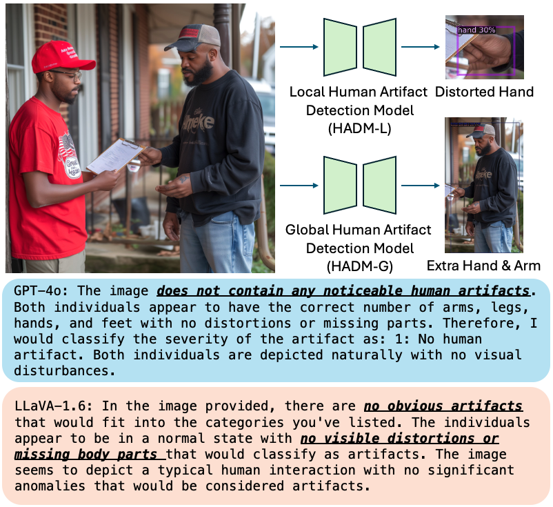

# Detecting Human Artifacts from Diffusion Models

Dataset and source code for [Detecting Human Artifacts from Text-to-Image Models](https://arxiv.org/abs/2411.13842).



## Setup

### Environment

We setup the environment following [``EVA-02-det``](https://github.com/baaivision/EVA/tree/master/EVA-02/det#setup).

```bash
conda create --name hadm python=3.8 -y
conda activate hadm

pip install torch==1.12.1+cu116 torchvision==0.13.1+cu116 --extra-index-url https://download.pytorch.org/whl/cu116
pip install cryptography
pip install -r requirements.txt
pip install -v -U git+https://github.com/facebookresearch/xformers.git@v0.0.18#egg=xformers
pip install mmcv==1.7.1 openmim
mim install mmcv-full

python -m pip install -e .
```

## Dataset: Human Artifact Dataset (HAD)

We provide the dataset used in the paper. The dataset is available in the following link: [HADM Dataset](https://www.dropbox.com/scl/fi/823u0q183t0oamaxcg4qv/human_artifact_dataset.zip?rlkey=nbz2vvg14av43h66ac1p7kbvb&st=9e8q0gcf&dl=0). 

The structure of the dataset should look like:
```bash
|-- annotations
|   |-- train_ALL
|   |-- val_ALL
|   |-- val_dalle2
|   |-- val_dalle3
|   |-- val_mj
|   `-- val_sdxl
|-- images
|   |-- train_ALL
|   |-- val_ALL
|   |-- val_dalle2
|   |-- val_dalle3
|   |-- val_mj
|   `-- val_sdxl
`-- info.pkl
```
Note that we provide the validation set for each domain for the convenience of the evaluation, and val_ALL is the combination of all validation sets. The info.pkl file contains the information of the dataset, including the image filename and the corresponding propmt for generating the image.

Finally, set the environment variable for the dataset path:
```bash
export DETECTRON2_DATASETS=datasets
```

### Additional Real Human Images for Training
After downloading our Human Artifact Dataset, please place it under the ``datasets`` directory. Then, download the training images from the follwoing real datasets: [LV-MHP-v1](https://drive.google.com/file/d/1hTS8QJBuGdcppFAr_bvW2tsD9hW_ptr5/view), [OCHuman](https://cg.cs.tsinghua.edu.cn/dataset/form.html?dataset=ochuman), [CrowdHuman](https://www.crowdhuman.org/download.html), [HCD](https://shijianping.me/codel/dataset.html), [Facial Descriptors](https://gtanisik.github.io/projects/hii.html). We also filtered [COCO](https://cocodataset.org/#download) with [ViTPose](https://github.com/ViTAE-Transformer/ViTPose) and find the images with human presence, and the filtered COCO images are available [here](https://www.dropbox.com/scl/fi/1oo0xeakwh5a571k8axy6/coco_train2017_human.zip?rlkey=mqvpw3pfl3wtkwirjmv51i0fb&st=pxljhi6u&dl=0).

After downloading these datasets, please place them under the ``datasets/human_artifact_dataset/images`` directory. The structure of the dataset should look like:
```bash
datasets/human_artifact_dataset/images/
|-- coco_train2017_human
|-- CrowdHuman
|-- facial_descriptors_dataset_images
|-- HCDDataset_images
|-- LV-MHP-v1-images
|-- OCHuman
|-- train_ALL
|-- val_ALL
|-- val_dalle2
|-- val_dalle3
|-- val_mj
`-- val_sdxl
```

Also, generate the corresponding empty annotation files under ``datasets/human_artifact_dataset/annotations`` for the training images from the real datasets by running the following command:

```bash
python datasets/generate_empty_anno.py --data_root datasets/human_artifact_dataset/images/coco_train2017_human
python datasets/generate_empty_anno.py --data_root datasets/human_artifact_dataset/images/CrowdHuman
python datasets/generate_empty_anno.py --data_root datasets/human_artifact_dataset/images/facial_descriptors_dataset_images
python datasets/generate_empty_anno.py --data_root datasets/human_artifact_dataset/images/HCDDataset_images
python datasets/generate_empty_anno.py --data_root datasets/human_artifact_dataset/images/LV-MHP-v1-images
python datasets/generate_empty_anno.py --data_root datasets/human_artifact_dataset/images/OCHuman
```

## HADM Pre-trained Weights

Make sure to download the pretrained weights for EVA-02-L from ``EVA-02-det`` and place them under the `pretrained_models` directory. The pretrained weights can be downloaded from [here](https://huggingface.co/Yuxin-CV/EVA-02/blob/main/eva02/det/eva02_L_coco_det_sys_o365.pth).

We provide the pretrained weights for the Local Human Artifact Detection Model (HADM-L) and Global Human Artifact Detection Model (HADM-G) models to reproduce the results presented in the paper. The pretrained weights can be downloaded from the following links:
- [HADM-L](https://www.dropbox.com/scl/fi/zwasvod906x1akzinnj3i/HADM-L_0249999.pth?rlkey=bqz5517tm8yt8l6ngzne4xejx&st=k1a1gzph&dl=0)
- [HADM-G](https://www.dropbox.com/scl/fi/bzj1m8p4cvm2vg4mai6uj/HADM-G_0249999.pth?rlkey=813x6wraigivc6qx02aut9p2r&st=n8rnb47r&dl=0)

Also make sure to place the pretrained weights under the `pretrained_models` directory.


## Demo

***Please note that our models take JPEG images as input, so make sure to make the necessary conversions.***

### Local Human Artifact Detection Model (HADM-L)

<details>
<summary>Inference HADM-L on arbitrary input images under demo/images.</summary>

```bash
python tools/lazyconfig_train_net.py --num-gpus 1 --inference \
    --config-file projects/ViTDet/configs/eva2_o365_to_coco/demo_local.py \
    train.output_dir=./outputs/demo_local \
    train.init_checkpoint=pretrained_models/HADM-L_0249999.pth \
    dataloader.train.total_batch_size=1 \
    train.model_ema.enabled=True \
    train.model_ema.use_ema_weights_for_eval_only=True \
    inference.input_dir=demo/images \
    inference.output_dir=demo/outputs/result_local
``` 

Results will be saved under ``demo/outputs/result_local``.
</details>


### Global Human Artifact Detection Model (HADM-G)


<details>
<summary>Inference HADM-G on arbitrary input images under demo/images.</summary>

```bash
python tools/lazyconfig_train_net.py --num-gpus 1 --inference \
    --config-file projects/ViTDet/configs/eva2_o365_to_coco/demo_global.py \
    train.output_dir=./outputs/demo_global \
    train.init_checkpoint=pretrained_models/HADM-G_0249999.pth \
    dataloader.train.total_batch_size=1 \
    train.model_ema.enabled=True \
    train.model_ema.use_ema_weights_for_eval_only=True \
    inference.input_dir=demo/images \
    inference.output_dir=demo/outputs/result_global
``` 

Results will be saved under ``demo/outputs/result_global``.
</details>


## Evaluation

### Local Human Artifact Detection Model (HADM-L)

<details>
<summary>Evaluate HADM-L on all domains (SDXL, DALLE-2, DALLE-3, Midjourney).</summary>

```bash
python tools/lazyconfig_train_net.py --num-gpus 1 --eval-only \
    --config-file projects/ViTDet/configs/eva2_o365_to_coco/eva02_large_local.py \
    train.output_dir=./outputs/eva02_large_local/250k_on_all_val \
    train.init_checkpoint=pretrained_models/HADM-L_0249999.pth \
    dataloader.evaluator.output_dir=cache/large_local_human_artifact_ALL_val/250k_on_all_val \
    dataloader.evaluator.dataset_name=local_human_artifact_val_ALL \
    dataloader.test.dataset.names=local_human_artifact_val_ALL \
    dataloader.train.total_batch_size=1 \
    train.model_ema.enabled=True \
    train.model_ema.use_ema_weights_for_eval_only=True 
``` 

Expected results:

```bash
Task: bbox
AP,AP50,AP75,APs,APm,APl
24.907,43.307,25.990,18.322,25.382,32.773
```
</details>


<details>
<summary>Evaluate HADM-L on a specific domains (SDXL in this example).</summary>

```bash
python tools/lazyconfig_train_net.py --num-gpus 1 --eval-only \
    --config-file projects/ViTDet/configs/eva2_o365_to_coco/eva02_large_local.py \
    train.output_dir=./outputs/eva02_large_local/250k_on_sdxl_val \
    train.init_checkpoint=pretrained_models/HADM-L_0249999.pth \
    dataloader.evaluator.output_dir=cache/large_local_human_artifact_sdxl_val/250k_on_sdxl_val \
    dataloader.evaluator.dataset_name=local_human_artifact_val_sdxl \
    dataloader.test.dataset.names=local_human_artifact_val_sdxl \
    dataloader.train.total_batch_size=1 \
    train.model_ema.enabled=True \
    train.model_ema.use_ema_weights_for_eval_only=True 
``` 

Expected results:

```bash
Task: bbox
AP,AP50,AP75,APs,APm,APl
21.141,39.529,21.372,17.813,22.557,26.149
```

To evaluate on other domains, you may also replace ``dataloader.evaluator.dataset_name`` and ``dataloader.test.dataset.names`` to ``local_human_artifact_val_<DOMAIN>`` (e.g., ``val_sdxl``, ``val_mj``, ``val_dalle2``, ``val_dalle3``).

</details>

### Global Human Artifact Detection Model (HADM-G)


<details>
<summary>Evaluate HADM-G on all domains (SDXL, DALLE-2, DALLE-3, Midjourney).</summary>

```bash
python tools/lazyconfig_train_net.py --num-gpus 1 --eval-only \
    --config-file projects/ViTDet/configs/eva2_o365_to_coco/eva02_large_global.py \
    train.output_dir=./outputs/eva02_large_global/250k_on_all_val \
    train.init_checkpoint=pretrained_models/HADM-G_0249999.pth \
    dataloader.evaluator.output_dir=cache/large_global_human_artifact_ALL_val/250k_on_all_val \
    dataloader.evaluator.dataset_name=global_human_artifact_val_ALL \
    dataloader.test.dataset.names=global_human_artifact_val_ALL \
    dataloader.train.total_batch_size=1 \
    train.model_ema.enabled=True \
    train.model_ema.use_ema_weights_for_eval_only=True 
``` 

Expected results:

```bash
Task: bbox
AP,AP50,AP75,APs,APm,APl
22.083,25.539,23.993,nan,0.000,22.332
```

</details>

<details>
<summary>Evaluate HADM-G on a specific domains (SDXL in this example).</summary>

```bash
python tools/lazyconfig_train_net.py --num-gpus 1 --eval-only \
    --config-file projects/ViTDet/configs/eva2_o365_to_coco/eva02_large_global.py \
    train.output_dir=./outputs/eva02_large_global/250k_on_sdxl_val \
    train.init_checkpoint=pretrained_models/HADM-G_0249999.pth \
    dataloader.evaluator.output_dir=cache/large_global_human_artifact_sdxl_val/250k_on_sdxl_val \
    dataloader.evaluator.dataset_name=global_human_artifact_val_sdxl \
    dataloader.test.dataset.names=global_human_artifact_val_sdxl \
    dataloader.train.total_batch_size=1 \
    train.model_ema.enabled=True \
    train.model_ema.use_ema_weights_for_eval_only=True 
``` 

Expected results:

```bash
Task: bbox
AP,AP50,AP75,APs,APm,APl
23.674,27.393,25.681,nan,0.000,23.891
```

Similarly, to evaluate on other domains, you may also replace ``dataloader.evaluator.dataset_name`` and ``dataloader.test.dataset.names`` to ``global_human_artifact_val_<DOMAIN>`` (e.g., ``val_sdxl``, ``val_mj``, ``val_dalle2``, ``val_dalle3``).

</details>

## Training

To train Local Human Artifact Detection Model (HADM-L):
```bash
python tools/lazyconfig_train_net.py \
    --config-file projects/ViTDet/configs/eva2_o365_to_coco/eva02_large_local.py \
    --num-gpus=1 train.eval_period=10000 train.log_period=500  \
    train.output_dir=./outputs/eva02_large_local \
    dataloader.evaluator.output_dir=cache/large_local_human_artifact_ALL_val \
    dataloader.train.total_batch_size=4
```

To train Global Human Artifact Detection Model (HADM-G):
```bash
python tools/lazyconfig_train_net.py \
    --config-file projects/ViTDet/configs/eva2_o365_to_coco/eva02_large_global.py \
    --num-gpus=1 train.eval_period=10000 train.log_period=500  \
    train.output_dir=./outputs/eva02_large_global \
    dataloader.evaluator.output_dir=cache/large_global_human_artifact_ALL_val \
    dataloader.train.total_batch_size=4
```


## Citation
If you find this work useful, please consider citing:
```bibtex
@article{Wang2024HADM,
  title={Detecting Human Artifacts from Text-to-Image Models},
  author={Wang, Kaihong and Zhang, Lingzhi and Zhang, Jianming},
  journal={arXiv preprint arXiv:2411.13842},
  year={2024}
}
```


## Acknowledgment
Our codebase is heavily borrowed from [EVA-02-det](https://github.com/baaivision/EVA/tree/master/EVA-02/det) and [Detectron2](https://github.com/facebookresearch/detectron2).
